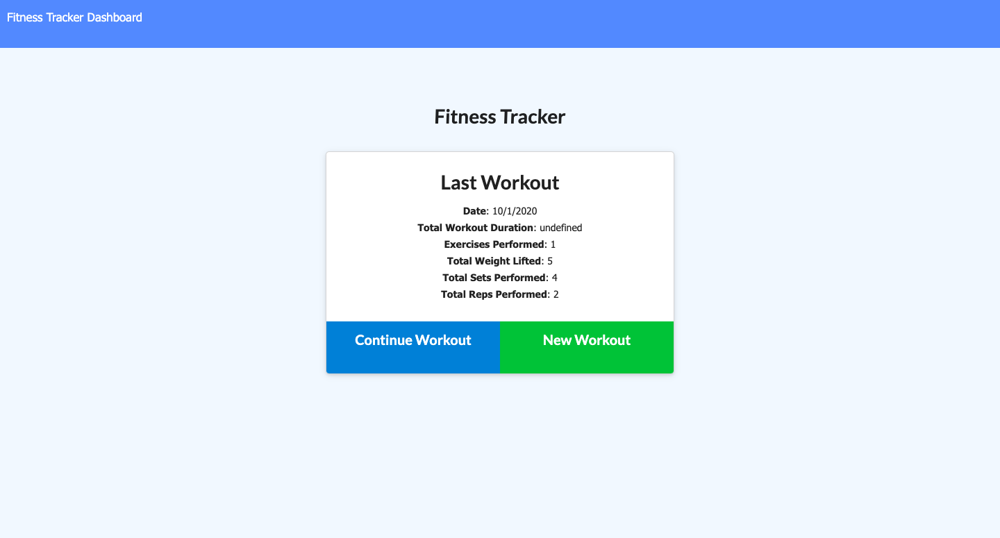
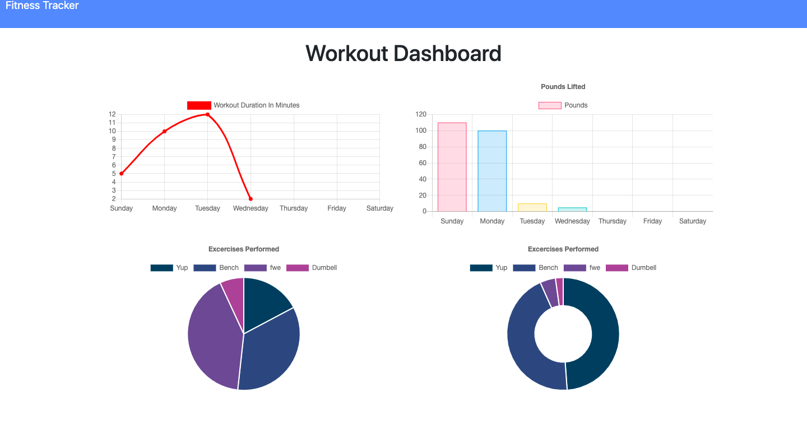

# Fitness Tracker
- The Fitness Tracker is an application used to add, track, and update the users workouts. 

# Table of Contents

* [Description](#description)
* [Links](#links)
* [Purpose](#purpose)
* [Contributors](#contributors)
* [Contact](#contact)
* [Credits](#credits)

# **Description**
* This Fitness Tracker was made with MongoDB, express.js, Javascript, HTML, and CSS. The server was made using express.js and utilized the html routes to direct users to the different pages of the application. The data that is inserted into each new workout is stored in a database using MongoDB account. There is a schema developed so that the application can properly display the information that the user inserts into each required field. The HTML and CSS were used for the styling and organization of the page. 

* Screenshot of Homepage after a workout is submitted:

* Screenshot of Dashboard:

# **Links**
* Github Overview: https://github.com/iariyami/fitness-tracker

* Deployed Heroku App: https://frozen-gorge-02227.herokuapp.com/

# **Purpose**
* The purpose of this application was to provide the user with a new and more efficient way of organizing and updating their workouts.

# **Contributors**
* Ibrahim Riyami

# **Contact**
* https://github.com/iariyami

* iariyami@ncsu.edu

# **Credits**
* nodejs.org

* https://www.npmjs.com/package/inquirer#question

* Heroku

* https://www.mongodb.com/